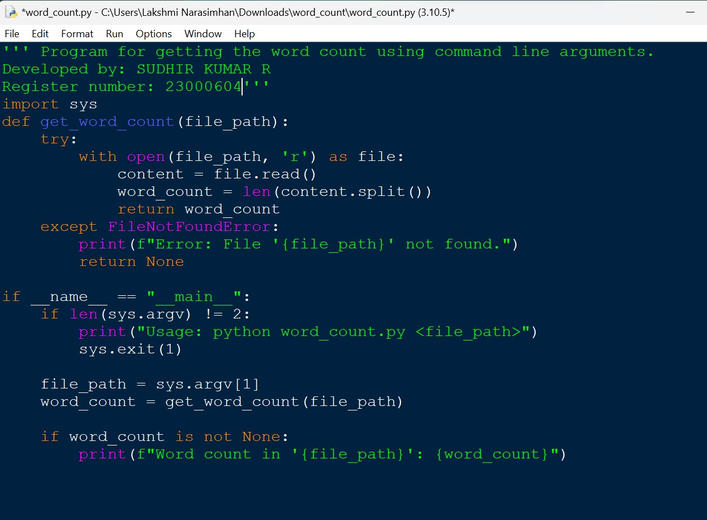
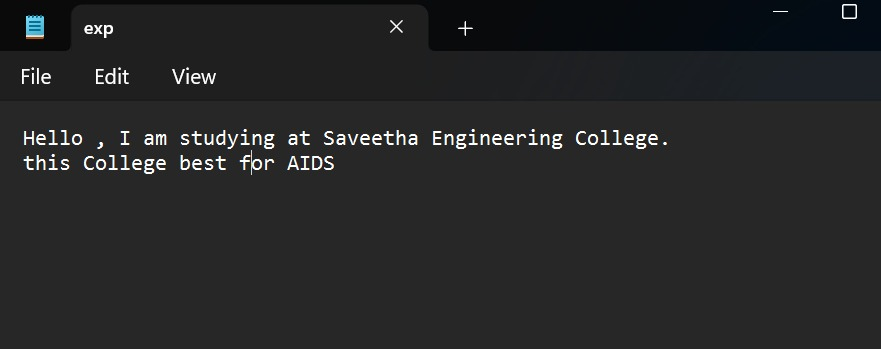
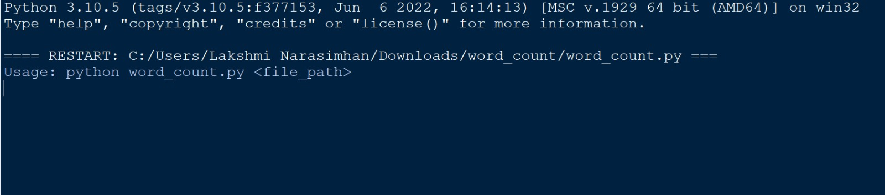
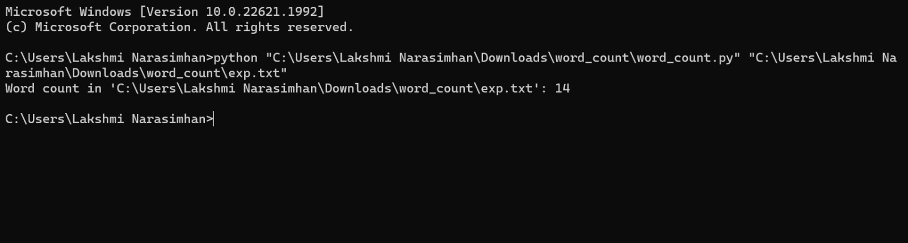

# command-line-arguments-to-count-word
## AIM:
To write a python program for getting the word count from the contents of a file using command line arguments.
## EQUIPEMENT'S REQUIRED: 
PC
Anaconda - Python 3.7
## ALGORITHM: 
### Step 1:
Import the module 
### Step 2: 
Define a function to calculate the word count
### Step 3: 
Check if the script is being run as the main program
### Step 4:  
Check if the correct number of command line argument is provided
### Step 5: 
Get the path from the command line argument and print the count of the word
### Step 6: 
End the program
## PROGRAM:
```python
''' Program for getting the word count using command line arguments.
Developed by: SUDHIR KUMAR R
Register number: 23000604'''
import sys
def get_word_count(file_path):
    try:
        with open(file_path, 'r') as file:
            content = file.read()
            word_count = len(content.split())
            return word_count
    except FileNotFoundError:
        print(f"Error: File '{file_path}' not found.")
        return None

if _name_ == "_main_":
    if len(sys.argv) != 2:
        print("Usage: python word_count.py <file_path>")
        sys.exit(1)

    file_path = sys.argv[1]
    word_count = get_word_count(file_path)

    if word_count is not None:
        print(f"Word count in '{file_path}': {word_count}")
```
### OUTPUT:







## RESULT:
Thus the program is written to find the word count from the contents of a file using command line arguments.
